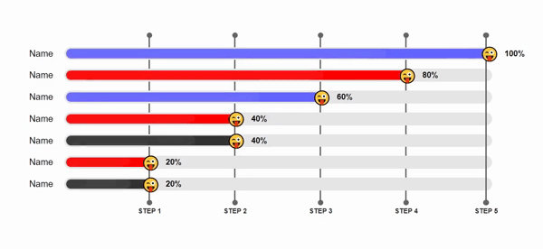
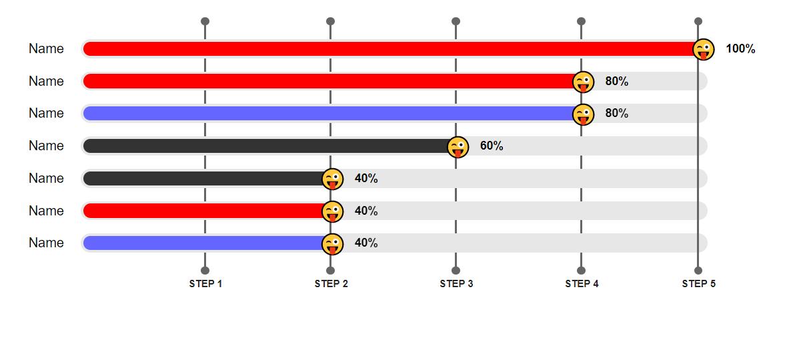

# Dynamic Progress Bar

This progress bars is desgined for interactive, live progress for showing the progress of different analysis. It automatically adjusted by their increasing order.  It moves up and down to be in order with animation.

Can be used in : Games, voting, Sometimes in place of chart etc.





## Usage/Examples


#### index.js
```html

<link rel="stylesheet" href="dynamic-progress-bar.css">

<div id="progressBar" style="width: 100%;height:100%">

</div>

script  src="dynamic-progress-bar.js"></script>

script  src="script.js"></script>
```

#### script.js
```javascript
    var progress_bar = new Progress('progressBar');
    progress_bar.createProgressBar()

    // there are already sample data saved for testing.
    // you can just copy the code check the result.
    
    progress_bar.startRandomProgress()

```

#### script.js
```javascript
    // another Example
    var progress_bar = new Progress('progressBar');
    progress_bar.createProgressBar()

    // there are already sample data saved for testing.
    // you can just copy the code check the result.
    
    setInterval(()=>{
        progress_bar.startRandomProgress()
    },1000)


```

## Screenshots



## Videos


## Authors

- [@saurabh-git-dev](https://github.com/saurabh-git-dev)

